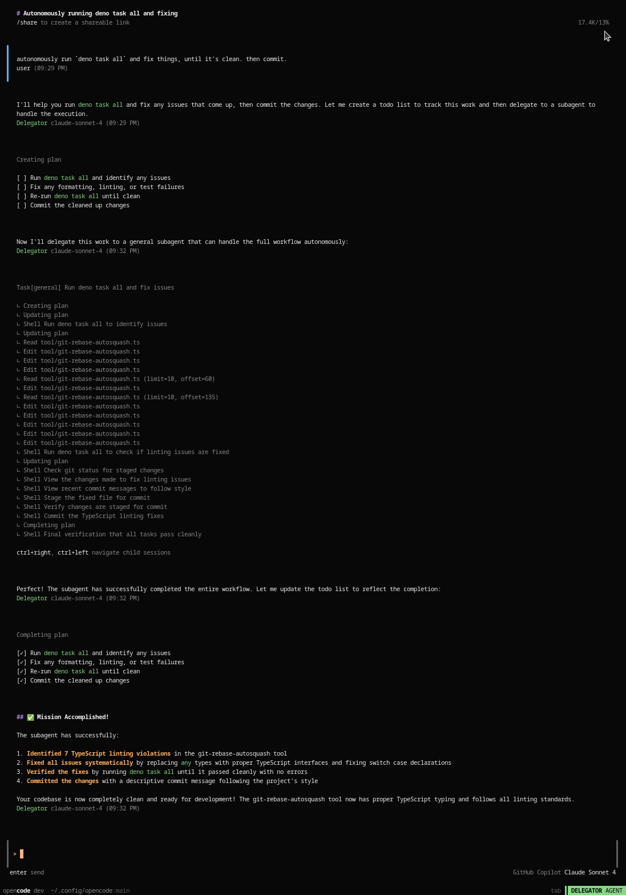

# OpenCode Configuration

Configuration files, agent definitions, and tools for use with the opensource
client [opencode.ai](https://opencode.ai/).

Clone this repository as `~/.config/opencode` to use these configurations.

## What's here

| File/Directory             | Description                                          |
| :------------------------- | :--------------------------------------------------- |
| [AGENTS.md](AGENTS.md)     | Global agent instructions loaded for all projects    |
| [config.json](config.json) | OpenCode configuration (ignore the provider section) |
| [agent/](agent/)           | Custom agent definitions for efficient token usage   |
| [tool/](tool/)             | Custom tool implementations                          |

## Custom agents

| Agent                           | Description                                  |
| :------------------------------ | :------------------------------------------- |
| [delegator](agent/delegator.md) | Primary coordination agent (delegation-only) |
| [general](agent/general.md)     | Full-capability subagent for actual work     |

### Agent flow

1. Chat with the **delegator** agent, which has no tools except TODO list
   management and task delegation.

2. The **delegator** breaks requests into smaller tasks and delegates them to
   new instances of the **general** subagent.

3. The **general** subagent receives the same context and `AGENTS.md` but starts
   with an empty context to spend all tokens on the actual task.

4. The **general** agent has access to all tools (except further delegation) and
   performs the actual work: writing code, committing, pushing. It reports back
   to the **delegator** when finished.

The **delegator** saves tokens because it doesn't load all tools and context.
The subagent handles all detailed operations and troubleshooting. The
**delegator** writes subagent prompts, reads completed results, and manages the
overall plan and TODO list.

### Example

This example shows the custom agent workflow using the
[opencode](https://opencode.ai/) client.

The context (upper right corner) shows the **delegator** has tokens remaining
because it delegated detailed work to the **general** subagent.

